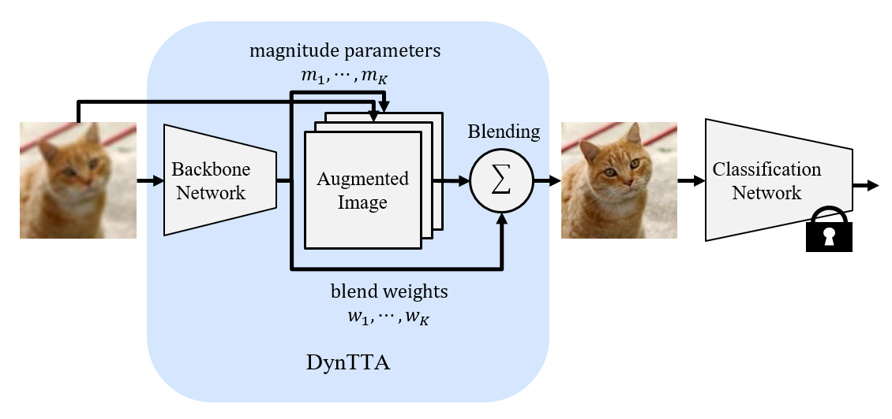

# Dynamic Test-Time Augmentation via Differentiable Functions
This is a pytorch implementation of the following paper [[IEEE Access]](https://ieeexplore.ieee.org/document/10713305) [[arXiv]](https://arxiv.org/abs/2212.04681):  

```
@article{enomoto2024dyntta,
  title={Dynamic Test-Time Augmentation via Differentiable Functions},
  author={Enomoto, Shohei and Busto, Monikka Roslianna and Eda, Takeharu},
  journal={IEEE Access},
  year={2024},
  publisher={IEEE}
}
```
Please read license.txt before reading or using the files.  

## Datasets
### ILSVRC2012 Dataset (ImageNet)

You can download the original ILSVRC2012 dataset (ImageNet) from [here](http://image-net.org/challenges/LSVRC/2012/), and corrupted version of ILSVRC2012 dataset (ImageNet-C) from[here](https://zenodo.org/records/2235448)

### CUB dataset

You can download the original Caltech-UCSD Birds-200-2011 dataset from [here](https://www.vision.caltech.edu/datasets/cub_200_2011/), and corrupted version of CUB dataset from [here](https://postechackr-my.sharepoint.com/:u:/g/personal/postekian_postech_ac_kr/EayI2FO8LT1PgFipwuUmLjsB3SEw585Nw9HcxUMO438LbA?e=j990QH).

## Pretrained models
Pretrained classification and image enhancement models can be downloaded [here](https://drive.google.com/drive/folders/1BIjLZ8mRJa56Bjc_ppzgfup93g6_EvZA?usp=drive_link).

## Training on the CUB dataset
### Non-blind setting
Accuracy of classification model only
```
python train.py --enhancer Identity
```

Training URIE
```
python train.py --enhancer URIE --lr 1e-3 
```

Training DynTTA (urie_weight="URIE/ECCV_SKUNET_OURS.ckpt.pt")
```
python train.py --enhancer DynTTA 
```

Result
|                           | Clean | Corruption |
|---------------------------|-------|------------|
| Classification model only | 0.817 | 0.490      |
| URIE                      | 0.781 | 0.598      |
| DynTTA                    | 0.805 | 0.675      |


## Bind setting
Accuracy of classification model only
```
python train.py --blind --enhancer Identity 
```

Training URIE
```
python train.py --blind --enhancer URIE --lr 1e-3 
```

Training DynTTA (urie_weight="pretrained_enhancers/CUB/Blind_URIE_latest.pth")
```
python train.py --blind --enhancer DynTTA --urie_weight ckp/CUB/Blind_URIE_latest.pth
```

Result
|                           | Clean | Corruption |
|---------------------------|-------|------------|
| Classification model only | 0.817 | 0.490      |
| URIE                      | 0.807 | 0.514      |
| DynTTA                    | 0.814 | 0.521      |
